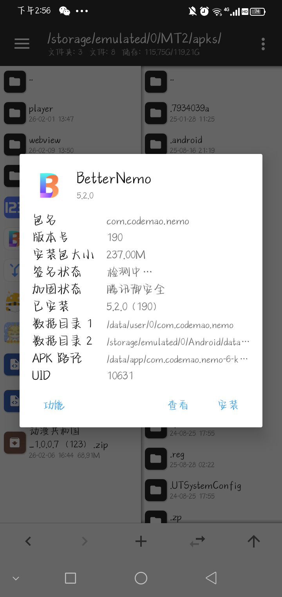
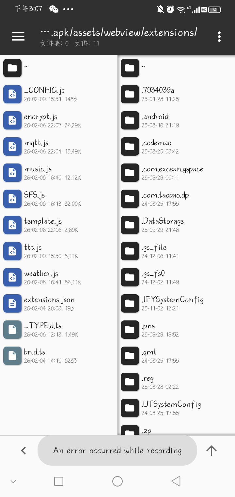

# 导入与管理
1. 使用 [MT管理器](https://mt2.cn/) 打开 BetterNemo 的apk，选择查看

图 1-1

(如 图 1-1 所示，点击 BetterNemo 的apk后弹出了一个信息显示框，下方分别是“功能”“查看”“安装”三个按钮)

2. 进入图示路径 /assets/webview/theme/

图 1-2

(如 图 1-2 所示，右侧文件栏为所示路径，内部存有主题本体及主题配置文件)

~~*(忽视下方提示，那是我的傻逼通知栏)*~~

*(图片错误，等待替换)*

3. 将扩展js添加进该路径中并更改

📎 [XRecorder_20260210_01.mp4](导入与管理/XRecorder_20260210_01.mp4)

视频 1-3

(如 视频 1-3 所示，添加主题文件夹，并加入到 _CONFIG.js 配置文件中)

*(视频错误，等待替换)*

4. 安装，进入 BetterNemo 检查安装情况