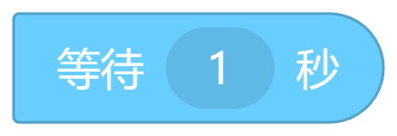
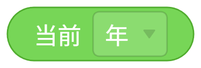
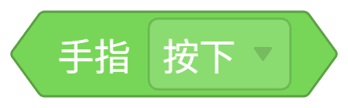
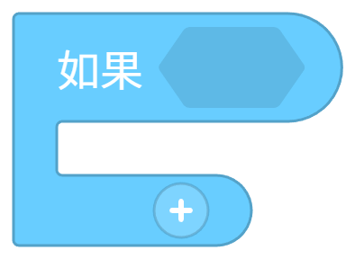
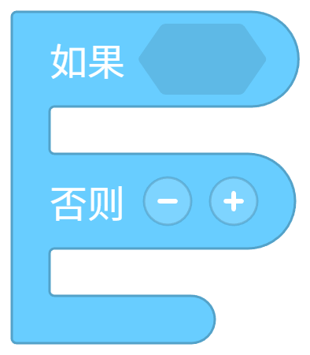
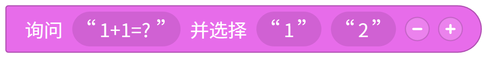

# 扩展详解
> 💡 
> ***计划中** *：实现TurboWarp拓展解析
> 
> 这是一个早期尝试👇
> 
> [加载器预览扩展](https://gitee.com/SandMo/BetterNemo-Extensions/tree/master/Extensions/%E6%95%B0%E6%8D%AE%E5%A4%84%E7%90%86%E7%B1%BB/%5BScratch%E6%89%A9%E5%B1%95%E5%8A%A0%E8%BD%BD%E5%99%A8%5DScrExtLoader)

> 💡 
> 本文档描述有对于 BN 扩展（Extensions）编写开发的相关内容与事项，包括文件结构、扩展接口、积木定义等等。请务必在开发 BN 扩展前<u>**仔细阅读** </u>该文档，以免造成不必要的开发错误。

# 什么是扩展？

BetterNemo 编辑器已拥有了扩展（Extensions）功能。扩展是编辑器重要的组成部分，开发者可以使用 JS 编写属于自己的扩展，实现特定的功能。比如实现连接外部硬件、网络服务、查询天气功能等。

> 计划中：当然，也可以把扩展提交给官方，官方通过审核后，上架到扩展商城。

---

# 扩展整体结构

<!-- 画板 Clh2wyqqVhwls6bBkGjcX04knbd 需要相应权限才能下载 -->

---

# 扩展结构详解

##   *0. 类型文件引入

特殊的**注释** ，用于自动补全，不会引起报错

```typescript
/// <reference path="../_TYPE.d.ts"/>
```

##   1. 扩展信息声明

位于**文件开头** ，通过 `Extension.metaData` 对象来对扩展信息进行声明

```javascript
Extension.metaData = {
    name: "扩展模板",
    version: "0.0.1", // 建议参考[<u>“语义化版本”</u>](https://semver.org/lang/zh-CN/)
    description: "一个普通的描述",
    author: "写上你的名字",
    docs: "https://codemao.lambdark.com" // (选填)虽然可以没有，但是建议你做一个
};
```

- `name`：名称 *（字符串）*

- `version`：版本*（字符串）*

- `description`：说明*（字符串）*

- `author`：作者*（字符串）*

- `docs`：文档链接*（字符串）*

---

##   2. 扩展主体

扩展通过一个异步[立即调用函数表达式(IIFE)](https://developer.mozilla.org/docs/Glossary/IIFE)进行封装，扩展主体代码置于其内部。

```javascript
(async (Extension) => {
    'use strict';
    // 扩展主体
})(Extension);
```

> 💡 
> 使用该模板可以防止扩展在尝试定义同名的变量、类或函数时相互干扰。通过要求所有内容都必须在异步[立即调用函数表达式(IIFE)](https://developer.mozilla.org/docs/Glossary/IIFE)中定义并启用[严格模式](https://developer.mozilla.org/docs/Web/JavaScript/Reference/Strict_mode)，我们可以防止变量意外泄露到全局作用域。

---

###   2.1 扩展接口定义

将此段代码写于**主体顶部** ，切勿丢失！

```javascript
const BN = Extension.API;
const Block = BN.Block;
const Toolbox = BN.Toolbox;
```

#### *2.1.1 依赖引入

如果你的积木解释器或者扩展的什么别的地方用了依赖，请仔细阅读本节

```javascript
// 若此依赖仅在**解释器内（积木运行的时候）** 使用，请在**接口定义后** 插入以下内容，不等待加载
BN.loadScript('依赖相对于扩展入口index.js的路径');
// 若此依赖**在其它部分** 也有使用，请在**使用处前（最好在积木样式定义后，以免造成加载失败）** 插入以下内容来确保依赖加载完成
await BN.loadScript('依赖相对于扩展入口index.js的路径');
```

路径举例：

|  | 扩展路径 | 依赖路径 | 你要写在代码里的路径（依赖相对路径） |
| --- | --- | --- | --- |
| 扩展A | extension/A | extension/A/utils/c.min.js | utils/c.min.js |
| 扩展B | extension/B | extension/B/runtime/d.min.js | runtime/d.min.js |

---

###   2.2 积木

在开始设计自定义积木之前，我们建议您阅读[B6yawpZnGimWgAkLyjBci3qvnnf]

#### 2.2.1 Blockly加载

在积木定义上方<u>**必须** </u>添加此行等待，以保证你的积木能被正常加载

```javascript
await BN.waitBlocklyLoaded();// 这条语句会等待Blockly加载完毕，别动
```

---

#### 2.2.2 自定义颜色

> 💡 
> 对于已有积木的扩展，我们**不建议** 您使用自定义颜色

对于你的积木，你可以使用Nemo内部已有颜色，详细请见文档 [附录 A.1](https://better-nemo.feishu.cn/wiki/I1EPwayIAiiEpakKIRscVPxrnL0#share-PPWSdqYw5oGcQUxKTy1cbwOCncd) 进行了解。

或是你有什么乱七八糟天马行空的配色需求，可以使用以下语句进行颜色注册

```javascript
BN.regColor(Name, Fill, Border);
//例子：BN.regColor("TEMPLATE_HUE", "#ff9900", "#ff9900");
```

- `Name`：名称*（字符串）*

- `Fill`：内廓颜色*（Hex颜色字符串）*

- `Border`：边缘颜色*（Hex颜色字符串）*

注：该类颜色注册后仅供积木使用（因为是积木的颜色数据结构），不要在如积木盒（Toolbox）等非使用积木颜色数据结构的地方调用这个颜色。

---

#### 2.2.3 自拟事件图标

作为训练师的你，必然知道事件积木都拥有一个头部图标


图2.2.2-1 当开始被点击

图2.2.2-2 当<自己>被<点击>

如果你也想要注册一个图标，可以使用如下语句定义

```yaml
const AEventIconField = {
    type: "field_icon",
    is_head: true,
    src: "data:image/svg+xml;charset=utf-8;base64,PHN2ZyB4bWxucz0iaHR0cDovL3d3dy53My5vcmcvMjAwMC9zdmciIHhtbG5zOnhsaW5rPSJodHRwOi8vd3d3LnczLm9yZy8xOTk5L3hsaW5rIiB3aWR0aD0iMzhweCIgaGVpZ2h0PSIzOHB4IiB2aWV3Qm94PSIwIDAgMzggMzgiIHZlcnNpb249IjEuMSI+CiAgICA8dGl0bGU+aWNuX2Jsb2NrbHlfaGVhZF9pbnRlcm5ldDwvdGl0bGU+CiAgICA8ZyBpZD0iaWNuX2Jsb2NrbHlfaGVhZF9pbnRlcm5ldCI+CiAgICAgICAgICAgICAgICAgICAgPGNpcmNsZSBpZD0iT3ZhbC0zIiBzdHJva2U9IiNiYjAwYmIiIHN0cm9rZS13aWR0aD0iMS4wOCIgZmlsbD0iI0ZGRkZGRiIgY3g9IjE5IiBjeT0iMTkiIHI9IjE4LjQ2Ii8+CiAgICAgICAgICAgICAgICAgICAgPGcgaWQ9Iue8lue7hCIgdHJhbnNmb3JtPSJ0cmFuc2xhdGUoNy4wMDAwMDAsIDcuMDAwMDAwKSI+CiAgICAgICAgICAgICAgICAgICAgICAgIAogICAgICAgICAgICAgICAgICAgICAgICA8cGF0aCBkPSJNOC42MTEzOTQxNSw5LjY4NTUzNzQ3IEM4LjYxMTM5NDE1LDkuNjg1NTM3NDcgMTAuMTQ2MTY5Myw5Ljc4MzcyNzc1IDEwLjQwNTUyMiw3Ljk2MDM3NDEgQzEwLjQwNTUyMiw3Ljk2MDM3NDEgMTMuNDQ0NjksOC4yNDMwNjU0MSAxNS44Njg0MzQyLDkuNjg1NTM3NDcgQzE1Ljg2ODQzNDIsOS42ODU1Mzc0NyAxNS4yODQzMzg3LDExLjUyOTkxNjkgMTYuNzg2NDE4NywxMi40MzI3NjI5IEMxNi43ODY0MTg3LDEyLjQzMjc2MjkgMTUuMjcxNTEyOSwxNC43MTg1NzgxIDExLjgyMjM0MjYsMTYuMzYwNzk0OCBDMTEuODIyMzQyNiwxNi4zNjA3OTQ4IDExLjE0MDE2MTksMTQuNzc1ODczMiA5LjM1NTM5MDU2LDE1LjA3MDEyODcgQzkuMzU2NTQ2OTgsMTUuMDcwMTI4NyA4LjYzMTI2MzQ5LDEzLjY2OTcwODIgOC42MTEzOTQxNSw5LjY4NTUzNzQ3IEw4LjYxMTM5NDE1LDkuNjg1NTM3NDcgWiBNOS41MTg5NzA5NSw1LjYxNDk1MDkxIEM5LjUxODk3MDk1LDUuNjE0OTUwOTEgMTAuMjk5MjM2OCw2LjI0NTcyMzYyIDEwLjMyODM1NzUsNi44MjAzNTc1NiBDMTAuMzI4MzU3NSw2LjgyMDM1NzU2IDEzLjYyNjg3ODIsNy4wMjU4ODQzMyAxNi40ODUxMTk2LDguODI1ODk5MzkgQzE2LjQ4NTExOTYsOC44MjU4OTkzOSAxNy43NjE4MDM2LDcuNzczNDU1MTIgMTguOTk2MzMwOSw4LjU1NzE5MDIyIEMxOC45OTYzMzA5LDguNTU3MTkwMjIgMTkuNjczODg1OSw3LjI5ODA2Mjc2IDE5LjgxNjMzNTUsNC45ODQxNzgyIEMxOS44MTYzMzU1LDQuOTg0MTc4MiAxNy4yNjUzODU1LDEuNjIwMjY3MzMgMTEuOTQzNzY2NCwxLjUgQzExLjk0MTQ1MzUsMS41MDExNTY0MiA5Ljg2NDczOTUyLDQuMzMzNjQxMjcgOS41MTg5NzA5NSw1LjYxNDk1MDkxIEw5LjUxODk3MDk1LDUuNjE0OTUwOTEgWiBNMjAuNzI4NTM3OSw2LjI5MzU1NzIyIEMyMC43Mjg1Mzc5LDYuMjkzNTU3MjIgMjMuMzg4MTkxMSw5LjM1Mzg1NjE1IDIyLjE4OTgyOCwxNC41NDgwNTkyIEMyMi4xODk4MjgsMTQuNTQ4MDU5MiAyMC43MTMzOTk0LDEyLjE2MDU4NDUgMTkuOTc4NjU0MywxMS42MDY5NzYzIEMxOS45Nzg2NTQzLDExLjYwNjk3NjMgMjAuNjM3NDk2NCwxMC4zMjY4MjMxIDE5Ljg4MTcyNTYsOS4zODI5NzY4MiBDMTkuODgxNzI1Niw5LjM4MTgyMDQxIDIwLjU4NDkzMiw4LjAwMjQyNTYyIDIwLjcyODUzNzksNi4yOTQ3MTM2MyBMMjAuNzI4NTM3OSw2LjI5MzU1NzIyIFogTTExLjM3MDI4ODksMTguODE0OTIxMiBDMTEuMzcwMjg4OSwxOC44MTQ5MjEyIDExLjgyNDY1NTUsMTguNjE2MzMyOSAxMS45OTI4NjE1LDE3LjUxMTMyNDIgQzExLjk5Mjg2MTUsMTcuNTExMzI0MiAxNS42NTIyODk0LDE2LjIyNTM4ODkgMTcuOTA4OTgzOSwxMi43NzQ5NTcxIEMxNy45MDg5ODM5LDEyLjc3NDk1NzEgMTguNjIzNzU0NSwxMi44MjE3Mzk0IDE5LjEyNDkwMzQsMTIuNDMyNzYyOSBDMTkuMTI0OTAzNCwxMi40MzI3NjI5IDIwLjgzMjUxMDMsMTQuMDI3MTQ2IDIxLjY0MjAwMTksMTYuMTEwOTAzNyBDMjEuNjQyMDAxOSwxNi4xMTA5MDM3IDIwLjA0ODc3NTIsMjAuNjY5NzA4MyAxNC44OTE4OTI5LDIyLjEzNTYyNDEgQzE0Ljg4OTU4MDEsMjIuMTM1NjI0MSAxMi41Njk5MTM0LDIwLjYyMTg3NDcgMTEuMzcwMjg4OSwxOC44MTM3NjQ4IEwxMS4zNzAyODg5LDE4LjgxNDkyMTIgWiBNMy44NDExNzU1MiwxOC42NTEzNDA4IEMzLjg0MTE3NTUyLDE4LjY1MTM0MDggNi42ODA1OTg4OCwyMy4wNDg5ODMgMTMuMjY3MTI3NSwyMi40NDM5NjY4IEMxMy4yNjcxMjc1LDIyLjQ0Mzk2NjggMTAuOTI3NTkxNSwyMC4yMTUzNDE3IDEwLjQ0NjQxNzEsMTkuNDk4MTUzMSBDMTAuNDQ2NDE3MSwxOS40OTgxNTMxIDguNjEyNTUwNTYsMTkuOTUzNzgxMyA3Ljk3OTQ2NTAyLDE4LjY1Mzc1ODcgQzcuOTc4MzA4NiwxOC42NTEzNDA4IDUuNjA5NTQ2ODIsMTkuMDA5OTM1MSAzLjg0MTE3NTUyLDE4LjY1MTM0MDggTDMuODQxMTc1NTIsMTguNjUxMzQwOCBaIE02LjA3OTA1MTk3LDguMTgyMzAwOTcgQzYuMDc5MDUxOTcsOC4xODIzMDA5NyAzLjQwMzEwMzg3LDguNzUyMzA5MjQgMS42ODM4Mjc3MiwxMC4wMjMxMDYgQzEuNjgzODI3NzIsMTAuMDIzMTA2IDAuNzg5MDc2NjMyLDEzLjgwMTY0NDggMi45NDc1ODA4NSwxNy4zMzUwMjMzIEMyLjk0NzU4MDg1LDE3LjMzNTAyMzMgNS4xNzE1ODAzLDE3LjgyMjA4NDkgNy40MDk1NjE4NywxNy41OTU0MjczIEM3LjQwOTU2MTg3LDE3LjU5NTQyNzMgNy4zOTQzMTgyLDE2LjE5Mzg1MDMgOC4zMDMwNTE0MiwxNS40OTI5NTY3IEM4LjMwMzA1MTQyLDE1LjQ5Mjk1NjcgNy4yMDA0NjA3MiwxMi42NDY0ODk3IDcuNDc0OTUxOTgsOS42MTc4MzQ1MyBDNy40NzQ5NTE5OCw5LjYxNjU3Mjk4IDYuMzM5NTYxMSw5LjM0MDkyNTMxIDYuMDgwMzEzNTIsOC4xODM0NTczOSBMNi4wNzkwNTE5Nyw4LjE4MjMwMDk3IFogTTIuMTM4MTk0MzMsOC4zOTYwMjc3OSBDMi4xMzgxOTQzMyw4LjM5NjAyNzc5IDMuOTg3MDk0MjcsMi43MTM2MDY3IDEwLjMzMDc3NTQsMS42Mzc4MjM4NCBDMTAuMzMwNzc1NCwxLjYzNzgyMzg0IDkuMzU3NzAzMzksMy4wMzcwODc5NyA4LjQzMjY3NTIxLDUuMjY4MDI1OTIgQzguNDMyNjc1MjEsNS4yNjgwMjU5MiA2LjQ4Njc0MTQsNS4wNTQyOTkxIDYuMDMxMjE4MzcsNy4wNDExMjgwMSBDNi4wMzEyMTgzNyw3LjA0MjI4NDQyIDMuOTUzMjQyODEsNy40MTg0MzUyMiAyLjEzNjkzMjc5LDguMzk2MDI3NzkgTDIuMTM4MTk0MzMsOC4zOTYwMjc3OSBaIiBpZD0i572R57ucIiBmaWxsPSIjYmIwMGJiIi8+CiAgICAgICAgICAgICAgICAgICAgPC9nPgogICAgICAgICAgICAgICAgPC9nPgo8L3N2Zz4=",
    width: 38,
    height: 38,
    alt: "*",
};
```

- `AEventIconField`：图标名称*（建议使用*`***``*扩展*``*名*EventIconField*`*的命名模式）*

- `type`: 固定为"field_icon"*（字符串）*

- `is_head`: 固定为true*（布尔值）*

- `src`: 图标的URL*（建议使用data url或稳定的图床）*

- `width`: 固定为38*（数）*

- `height`: 固定为38*（数）*

- `alt`: 固定为"*"*（字符串）*

> 💡 
> 其实图标也是 Nemo 内部的一种参数字段，详细可见 [积木参数](https://better-nemo.feishu.cn/wiki/XFR4w2FuKiel1RkPJAFccM3nn8e)

---

#### 2.2.4 积木样式定义集

在前头基操万事大吉后，您终于可以开始展开积木的编写了。（🎉✨）

定义一个 Blocks 集，在里头放入你的可爱积木们😋

```javascript
const BLOCKS_NAME = [
    {
        type: "template_block",
        message0: "这是模板里的一个自定义积木呀",
        args0: [
            /* 这里头是参数，具体类型后头详解 */
        ],
        /* ...Block.methodBlock */
        /* 积木类型等其它信息 */
    },
    {
        /* 以此类推... */
    },
                            /* 可以在这里使用map来简化颜色的定义 */
].map((block) => { return { ...block, colour: "%{BKY_BLOCKS_COLOR}" }; });
// 等待积木对象加载完毕，别动
await BN.waitBlockLoaded();
// 注册你的积木，别忘
BN.regBlocks(BLOCKS_NAME);
```

##### 集

- `BLOCKS_NAME`：积木集名称*（**你自己能看懂就行**）*

- `BLOCKS_COLOR`：颜色*（**颜色ID，详见  *[*附录 A.1*](https://better-nemo.feishu.cn/wiki/I1EPwayIAiiEpakKIRscVPxrnL0#share-PPWSdqYw5oGcQUxKTy1cbwOCncd)* **）*

##### 积木通用字段

> 💡 
> 不要定义type以**“__”** 开头的积木，这些积木用于定义事件参数

- `type`：积木ID*（字符串）（**不可重复，请仔细命名，建议在前面加上扩展标识，如“****example_** **xxx_block”**）*

- `message#`：积木字样*（字符串）（#为序号，一般*`*message0*`*）*

- `args#`：积木参数*（参数类）（#为序号，一般*`*args0*`*，详见 *[附录 A.2](https://better-nemo.feishu.cn/wiki/I1EPwayIAiiEpakKIRscVPxrnL0#share-OHfRdXoKhoYMfbxiy72c9C84nQh)* **）*

- `inputsInline`：是否单行显示*（布尔值）（默认为*`*true*`*，仅限方法积木使用）*

- `tooltip`：提示*（字符串）（PC环境显示）*

---

##### 积木类型及特有字段

##### 2.2.4.1 方法积木



图2.2.4-1 等待 ( 1 ) 秒


图2.2.4-2 重启

图2.2.4-1** ** 等待 是一块含有一个数值输入的方法积木，方法积木的特点是：<u>**上下均可连接，无返回值** </u>。有时图2.2.4-2 重启 这样下方不可连接的积木也被看作方法积木。

- `...Block.methodBlock`：方法积木模板

- `nextStatement`：下方能否连接，默认为true*（布尔值）*

##### 2.2.4.2 事件积木


图2.2.4-3 当开始被点击

图2.2.4-4 当<自己>被<点击>

图2.2.4-3** ** 当开始被点击** ** 和** ** 图2.2.4-4 当<自己>被<点击> 这样<u>**只可下方连接且具有触发运行作用** </u>的积木是事件积木。

- `...Block.eventBlock`: 事件积木模板

###### * 事件参数积木

(...)

##### 2.2.4.3 输出积木



图2.2.4-5 当前<年>



图2.2.4-6 手指<按下>

图2.2.4-5 当前<年> 和 图2.2.4-6 手指<按下> <u>**可以返回数字、字符串、布尔值、列表等** </u><u>**类型** </u><u>**值** </u>的积木是输出积木。

- `output`：输出类型*（字符串）（数据类型详见文档 *[附录 A.3](https://better-nemo.feishu.cn/wiki/I1EPwayIAiiEpakKIRscVPxrnL0#share-OQpodsC8XoAYvzxcCOHcdTv4nGh)* ）*

##### *2.2.4.4 扩展与变形器

> 💡 
> 本节中的**扩展** 均指在创建给定类型的每个分块时，在该分块上运行的函数

###### (1) 扩展


只看这个积木你可能很难猜到这是什么，所以我又找了一个包含它的积木


虽然styles_index_get看起来并不特殊，但它确实是一块有扩展的积木，扩展并不总是修改积木外形

```typescript
const NEMO_STAGE2D_EXTENSIONS = 'NEMO_STAGE2D_EXTENSIONS';
const NEMO_STAGE2D_EXTENSIONS_CONFIG = {
  show_editor: function(cb:(index:string) => void, value:string) {
    open_style_panel(value, cb);
  },
};
blockly.extensions.register_mixin(
  NEMO_STAGE2D_EXTENSIONS,
  NEMO_STAGE2D_EXTENSIONS_CONFIG,
);
```

```yaml
NEMO_AUDIO_EXTENSIONS: *ƒ ()*
NEMO_STAGE2D_EXTENSIONS: *ƒ ()*
controls_if_tooltip: *ƒ EXTENSION_CONTROLS_IF_TOOLTIP()*
disable_inside_warp_loop: *ƒ ()*
disable_inside_wrap_loop: *ƒ ()*
logic_op_tooltip: *ƒ ()*
math_op_tooltip: *ƒ ()*
nemo_audio_mixin: *ƒ ()*
nemo_dropdown_mixin: *ƒ ()*
nemo_midi_note_mixin: *ƒ ()*
param_block: *ƒ ()*
param_color_block: *ƒ ()*
parent_tooltip_when_inline: *ƒ EXTENSION_PARENT_TOOLTIP()*
set_pen_property_value: *ƒ ()*
text_quotes: *ƒ EXTENSION_TEXT_QUOTES()*
```

###### (2) 变形器

[👉 Blockly指南](https://developers.google.cn/blockly/guides/create-custom-blocks/mutators?hl=zh-cn)

####### a.简介

你可能注意到了这些积木，它们拥有一些独特的按钮，如图





图2.2.4-9 如果的两种形态



图2.2.4-10 询问 ("1+1=?") 并选择 ("1") ("2") ...

图2.2.4-9 和 图2.2.4-10 展示了两种可变形的积木，它们可以根据需要改变形状。这种<u>**可变形** </u>的积木就是带变形器的积木，它们大多有着标志性的加减按键

- `mutator`：变形器名称，**仅能有一个** *（**字符串**）*

> 请注意，与扩展程序不同，每种块类型只能有一个 mutator。
> 
> ——摘自 [Blockly指南](https://developers.google.cn/blockly/guides/create-custom-blocks/mutators?hl=zh-cn)

```json
ask_and_choose_mutator_codemao: *ƒ ()*
controls_if_mutator_codemao: *ƒ ()*
controls_if_one_else_mutator_codemao: *ƒ ()*
play_midi_section_mutator: *ƒ ()*
stamp_mutator_codemao: *ƒ ()*
text_join_mutator_codemao: *ƒ ()*
```

---

###   2.3 积木盒

####   2.3.1 积木盒内元素定义

我们提供了一些方法来帮助您快速定义积木盒

一些特殊的自定义积木可能需要手动输入XML，如果您没有接触过标记语言我们**建议** 您先[学习XML](https://www.runoob.com/xml/xml-tutorial.html)

```javascript
const BLOCKSXML = [
    Toolbox.title("标题 · Title"),
    Toolbox.line("我是小字"),
    Toolbox.sep(),
    Toolbox.block("block"),
    Toolbox.flyout_bottom(),
];
```

- `BLOCKSXML`：XML名称*（建议使用*`**扩展名*XML*`*的命名模式）*

行项：

- `Toolbox.title("")`：标题行*（字符串）*

- `Toolbox.line("")`：文字行*（字符串）*

- `Toolbox.sep()`：空行

- `Toolbox.block("")`：积木行*（积木ID字符串）*

- `Toolbox.flyout_bottom()`：收束线

你可以通过对这些行项代码的顺序调整增删来实现你想要的积木列表👍

####   2.3.2 图标及注册

定义完积木盒后，我们使用下方代码快速完成积木盒图标的添加和积木盒的注册

```javascript
// 为你的积木盒注册一个图标 svg
BN.regIcon(`<symbol id="TOOLBOXICON" viewBox="-1030 -960 2500 2500"><path d="M224 0c35.3 0 64 21.5 64 48 0 10.4-4.4 20-12 27.9-6.6 6.9-12 15.3-12 24.9 0 15 12.2 27.2 27.2 27.2l44.8 0c26.5 0 48 21.5 48 48l0 44.8c0 15 12.2 27.2 27.2 27.2 9.5 0 18-5.4 24.9-12 7.9-7.5 17.5-12 27.9-12 26.5 0 48 28.7 48 64s-21.5 64-48 64c-10.4 0-20.1-4.4-27.9-12-6.9-6.6-15.3-12-24.9-12-15 0-27.2 12.2-27.2 27.2L384 464c0 26.5-21.5 48-48 48l-56.8 0c-12.8 0-23.2-10.4-23.2-23.2 0-9.2 5.8-17.3 13.2-22.8 11.6-8.7 18.8-20.7 18.8-34 0-26.5-28.7-48-64-48s-64 21.5-64 48c0 13.3 7.2 25.3 18.8 34 7.4 5.5 13.2 13.5 13.2 22.8 0 12.8-10.4 23.2-23.2 23.2L48 512c-26.5 0-48-21.5-48-48L0 343.2c0-12.8 10.4-23.2 23.2-23.2 9.2 0 17.3 5.8 22.8 13.2 8.7 11.6 20.7 18.8 34 18.8 26.5 0 48-28.7 48-64s-21.5-64-48-64c-13.3 0-25.3 7.2-34 18.8-5.5 7.4-13.5 13.2-22.8 13.2-12.8 0-23.2-10.4-23.2-23.2L0 176c0-26.5 21.5-48 48-48l108.8 0c15 0 27.2-12.2 27.2-27.2 0-9.5-5.4-18-12-24.9-7.5-7.9-12-17.5-12-27.9 0-26.5 28.7-48 64-48z"></path></symbol>`);
// 添加你的积木盒
BN.addToolbox(TOOLBOXNAME, TOOLBOXICON, TOOLBOXCOLOR, BLOCKSXML);
```

- `BN.regIcon`：图标注册

- `TOOLBOXICON`：图标名称*（字符串）（**建议使用*`*icon-*扩展名**`*的命名**模式）*

- `BN.addToolbox`：积木盒注册

- `TOOLBOXNAME`：盒子名称*（字符串）（**建议直接用扩展名，****不能包含空格** **）*

- `TOOLBOXCOLOR`：盒子颜色*（Hex颜色字符串）（**最好与积木颜色相同**）*

- `BLOCKSXML`：积木盒XML*（你定义过的，见 **2.3.1** ）*

---

#####    < 图标获取&调整小技巧 >

网络仓库获取开源svg图标，但我有个损招😋，

关于图标获取&调整小技巧详见 [占位符] ~~*（视频还在剪）*~~

---

###   2.4 积木解释器

#### 2.4.1 通用积木解释器

Holy，终于到这一步了，你的啥博弈扩展开发终于是进入正题同时也是到结尾了

这部分代码定义了积木的具体实现，没这些代码你的扩展就是个中看不中用的纸老虎 ~~*（不是杯子不准打飞机）*~~

我们一般通过以下语句定义积木的实现

```javascript
await BN.waitRunmgrLoaded();//等待Runmgr加载完毕，别动

// ---------------------------解释器-------------------------------------

// 方法&输出积木
BN.regMethod('AMethodBlock', (params, uuid, uuid2, utills) => {
                           /* 常省作 (params, _, __, ___) */
    const input = params.arg#;
    /*参数获取*/
    return input; // 输出积木的输出
});
/*示例代码，非必要*/

// 事件积木
BN.regSimpleEvent('ASimpleEvent');
```

- `BN.regMethod`：注册方法

- `AMethodBlock`：方法&输出积木*（积木ID字符串）*

- `params`：参数集*（参数类）*

- `uuid`：*~~屏幕uuid？~~*（字符串）*

- `uuid2`：角色uuid*（字符串）*

- `utills`：*~~积木？~~*（未知类）*

- `arg#`：参数调用*（参数）*

- `BN.regSimpleEvent`：注册事件

- `ASimpleEvent`：事件积木*（积木ID字符串）*

关于事件的具体另见 [占位符]

> 💡 
> 可以将函数集成在积木解释器的定义上方，这样可以使代码更加美观，且能提高编写效率

#### 2.4.2 画笔积木解释器

如果需要在舞台上绘制图案，就需要请到画笔来帮助了。Nemo的画笔实现是基于HTML Canvas，因此我们可以简单地操纵Canvas上下文在舞台画布上绘画。

首先我们需要获取到上下文，而上下文是角色的一个子对象，因此我们需要先获取到actor。这里有一个万能的画笔头给大家：

```javascript
const actor = get_stage_target(uuid2);
if (!actor) return;
const brush = actor.get_brush();
if (!brush) return;
const ctx = brush.ctx;

const view = brush.app.get_app().view;
const center_x = view.width / 2;
const center_y = view.height / 2;
```

这样就获取到了ctx。然后在开始绘画前，需要先用`ctx.``save``()`保存一下画笔状态。

在绘画结束后，使用`actor.parent_scene.should_update_brush()`使绘画内容刷新到舞台上。

#### 2.4.2.1 舞台坐标转Canvas坐标

使用公式：

`canvas_x = center_x + stage_x`

`canvas_y = center_y - stage_y`

# 更多……

- 获得更好的开发体验请参考：[VdahwAqzribrhVkNdqWc3nWMncb]

- 扩展模板获取：[模板获取](https://wwbrc.lanzouq.com/iA3Ck3i7vewb)

- 扩展获取

# 鸣谢

@ou_94d7a0c605550d5a4172a31564a5267a@ou_3949aec3c040c24eb7648a572ff75d54@ou_38562f4fb4ef8635e9e0d1af4e64d3e5

（~~不~~分先后次序）