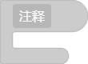
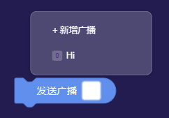
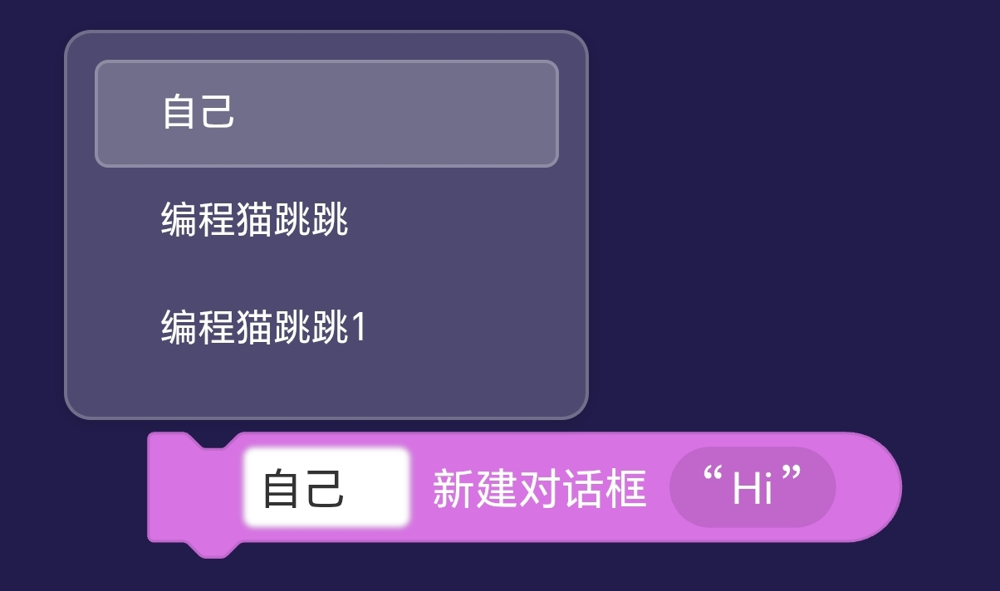
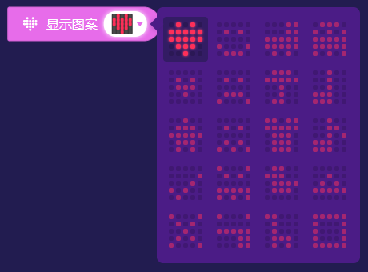
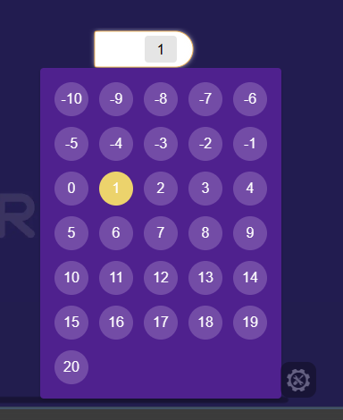
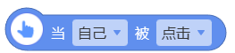
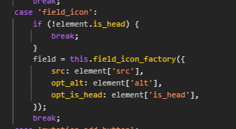

# A.2 积木参数
对于 Nemo 中的积木，Blockly & 编程猫 已经做了一套成熟的参数接口供积木使用。

关于从 Blockly 继承字段，可前往 [Blockly 指南 - 内置字段](https://developers.google.cn/blockly/guides/create-custom-blocks/fields/built-in-fields/overview?hl=zh-cn) 进行了解*（不保证仍可在** **Nemo** **中正常工作）*

以下是经整理列出的可用参数类型

# 待整理

- [ ] field_default_value

- [ ] field_textdropdown

- [ ] input_dummy *(很常用的占位字段)*

- [ ] input_statement

- [ ] mutation_add_button

- [ ] field_button

- [ ] field_dropdown_advanced

- [ ] field_label_serializable

---

# 传参性字段

## 文本输入(静态)

**大多数情况下你不会用到它** ，因为该输入仅能让用户提供一个静态的值

(意思就是你不能往里面塞返回值积木来传参)

[👉 Blockly 指南 - 文本输入字段](https://developers.google.cn/blockly/guides/create-custom-blocks/fields/built-in-fields/text-input)

```javascript
{
    type: "field_input",
    name: "arg", // 参数名称
    text: "默认文本"
}
```



- `type`：类型，固定为`"field_input"`*（字符串）*

- `name`：名称*（字符串）*

- `text`：默认值*（字符串）*

---

## 数字输入(静态)

**大多数情况下你不会用到它** ，因为该输入仅能让用户提供一个静态的值

[👉 Blockly 指南 - 数字字段](https://developers.google.cn/blockly/guides/create-custom-blocks/fields/built-in-fields/number)

```javascript
{
    type: "field_number",
    name: "arg", // 参数名称
    value: 0
}
```


- `type`：类型，固定为`"field_number"`*（字符串）*

- `name`：名称*（字符串）*

- `value`：默认值*（数）*

## 多行文本输入(静态)

**大多数情况下你不会用到它** ，因为该输入仅能让用户提供一个静态的值

```javascript
{
    type: "field_multiline_input",
    name: "arg",
    text: "默认文本",
    max_width: 264
}
```

- `type`：类型，固定为`"field_multiline_input"`*（字符串）*

- `name`：名称*（字符串）*

- `text`：默认值*（字符串）*

- `max_width`：最大长度*（数）*

## 值输入

此类型继承于Blockly，是 Nemo 最常见的参数形式，可以填数字、字符串、布尔值等等等等。

反正一般是能用值输入就不用别的，万用字符串。以下是关于值输入的定义

```javascript
{
    type: "input_value", //参数类型为 值输入
    name: "arg", // 参数名称
    check: "String", // 输入类型
    value: "", // 默认值
},
```

- `type`：类型，固定为`"input_value"`*（字符串）*

- `name`：名称*（字符串）*

- `check`：输入类型*（字符串**/列表**）**（列表表示其中类型均可）*

- `value`：默认值*（根据你的*`*check*`*决定**，*`*check*`*为字符串或数时有效**）*

---

## 下拉框

此类型继承于Blockly，下拉框在 Nemo 中的出现率不算低，也是比较常用的参数媒介，供用户在一定的选择中进行参数调控。对于参数更具可控力。

[👉 Blockly 指南 - 下拉菜单字段](https://developers.google.cn/blockly/guides/create-custom-blocks/fields/built-in-fields/dropdown)

```javascript
{
    type: "field_dropdown",
    name: "arg",
    options: [
        ["字样1", "choice1"],
        ["字样2", "choice2"],
        ["字样3", "choice3"]
        // 以此类推
    ],
    value: "字样1"
}
```

- `type`：类型，固定为`"field_dropdown"`*（字符串）*

- `name`：名称*（字符串）*

- `options`：输入类型*（列表）*

- `options[]`：选项列表*（下方详细）*

- `value`：默认值*（填入默认选项的key）*

> 💡 
> 选项的**一般** **格式** 为`[text, key]`，text表示显示的文本*（字符串）*，key表示提供给解释器的值*（任意）*

### 高级选项

选项的**完整格式** 为：`[text, key, icon?, callback?]`

右图是self_broadcast的选项，其中

- `+ 新增广播`具有自定义回调，不作为参数

- `Hi`是一个默认广播，其文案左侧有一个图标用于标识屏幕

扩展字段详解：



- icon：图标
    ```json
    {
        "src": SVGElement,
        "width": 16,
        "height": 16,
        "margin_right": 6
    }
    ```

- callback：自定义回调

```typescript
function (this: (id: string) => void){
    add_broadcast(this);
}
```

### 动态选项

右图是show_stage_dialog的选项，内容为角色列表

Q：但角色列表并不是静态的，难道每次添加/移除角色后都要重新定义这个积木吗

A：仅需向`options`传入一个函数，Blockly会调用函数，将返回内容作为选项内容



```javascript
{
  type: 'field_dropdown',
  name: 'sprite',
  options: function() {
    const arr = S.get_actor_dropdown_options();
    arr[0] = [blink.Msg['self'], '__self'];
    return arr;
  }
}
```

### 前缀/后缀匹配

你可能会注意到，选项内容并不总是完全按你定义的内容呈现

[👉 Blockly 指南 - 下拉菜单字段 - 前缀/后缀匹配](https://developers.google.cn/blockly/guides/create-custom-blocks/fields/built-in-fields/dropdown?hl=zh-cn#prefixsuffix_matching)

> 如果所有下拉菜单选项都包含相同的前缀和/或后缀字词，这些字词会自动分解出来并作为静态文本插入。
> 
> —— Blockly 指南 - 下拉菜单字段


```javascript
{
    type: "template_7",
    message0: "下拉框的 %1 匹配",
    args0: [{
    type: "field_dropdown",
    name: "dropdown",
    options: [
        ["[前缀 和 后缀]", "1"],
        ["[前缀  后缀]", "2"],
    ]
}
```

---

## 取色框

取色框是 Nemo 中作用域比较小的参数媒介，它会传递一个hex颜色字符串给解释器，用户界面可以使用调色板更改它的颜色值。

对于定义一个取色框，我们使用如下语句进行

```javascript
{
    type: "field_colour",
    name: "color",
    colour: "#cc66cc"
}
```

- `type`：类型，固定为`"field_colour"`*（字符串）*

- `name`：名称*（字符串）*

- `colour`：默认颜色*（HEX颜色字符串）*

---

## 钢琴

```javascript
{
    type: "field_piano",
    custom: true,
    name: "note",
    note: "C4"
}
```


## 姿势

？

```javascript
{
    type: "field_gesture",
    name: "gesture",
    custom: true
}
```


## 点阵

~~Ciallo～ (∠・ω< )⌒★~~

```javascript
{
    type: "field_led_matrix",
    name: "value",
    custom: true,
    value: "0101011111111110111000100"
}
```


## 点阵选择

~~咕咕嘎嘎！~~

```javascript
{
    type: 'field_led_matrix_selector',
    name: 'icon',
    custom: true,
    options: micribit_matrix_options,
}
```



## 数字选择

~~这不我家电梯吗~~

```javascript
{
    type: "field_number_advanced",
    custom: true,
    name: "NUM",
    value: 1,
    min: -10,
    max: 20,
    editor: "single_number"
}
```



# 非传参性字段

Nemo 中还存在一些非传递参数作用的字段，他们更像一种占位符，起到控制积木样式的作用

## ~~动态文本（可序列化标签）~~

你不会用到这个的，真的

---

## 图片

[👉 Blockly 指南 - 图片字段](https://developers.google.cn/blockly/guides/create-custom-blocks/fields/built-in-fields/image)

图片字段被用于标识积木功能

```javascript
{
    type: "field_image",
    src: "图片URL",
    width: 20,
    height: 20,
    alt: "*"
}
```


- `type`：类型，固定为`"field_image"`*（字符串）*

- `src`：图片源，支持data url*（字符串）*

- `width`：宽*（数）*

- `height`：高*（数）*

- `alt`：代替文本*（字符串）*

## 事件图标

用于控制事件积木图标

```javascript
{
    type: "field_icon",
    is_head: true,
    src: "图片URL",
    width: 38,
    height: 38,
    alt: "*"
}
```



- `type`：类型，固定为`"field_icon"`*（字符串）*

- `is_head`：固定为true*（布尔值）*

- `src`：图片源，支持data url*（字符串）*

- `width`：宽*（数）*

- `height`：高*（数）*

- `alt`：代替文本*（字符串）*

### 【你知道吗】is_head的处理逻辑

当is_head为`false`时则**不添加字段**

当is_head为`true`时则添加字段并**传递参数is_head** ,src,alt

和`return a == b ? b : a`有异曲同工之妙

真是充分考虑了 is_head 和 b 的意见👍

*注：右侧代码片段选自node_modules / @crc / blink / dist / core / workspace_element / block / block_svg.js的802~811行*

