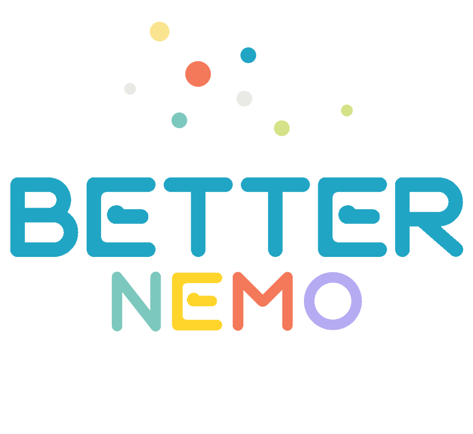

# 欢迎来到BetterNemo手册
> 💡 
> 本项目正在**Indev** 阶段，不代表最终质量，请在官方QQ群中获取快照。
> 
> 在2026.1.30及以后的快照格式：yyMMDD.fix 例：260130.1
> 
> 在2026.1.30前的快照格式：yyMMDD-fix 例：260129-1

> 💡 
> 本知识库是向创作者提供的 **BetterNemo** ** 帮助手册  ** ，部分内容由编程猫的创作者们征集汇编而成。
> 
> 感谢这些特别创作者的无私贡献，希望更多的创作者能在编程猫度过一段愉快的时光！

> 💡 
> 本文档不包含关于 Nemo 的帮助文档，有关 Nemo 的帮助文档，请参考 [<u>Nemo 手册</u>](https://www.yuque.com/pangguanzhejers/nemo_guide/ghvg2lwgtwmk1xbg)。

#   什么是 BetterNemo

**BetterNemo ** 是一个 Nemo 的修改版本，简称**BN** 。它通过注入自定义积木、扩展 API 功能和提供额外特性来提升创作者的编程体验。它并没有修改 Nemo 的核心代码，而是通过向现有系统注入扩展功能的方式工作，因此不可以无缝集成并直接利用 Nemo 编辑器的现有功能。

#   联系方式

**官方QQ群** ：1083164353

#   FAQ

##   Q: 我通过 BetterNemo 创建的作品发布/分享后他人可以查看吗

**   A: 使用** **BN Player** **或** **BetterNemo** **均可**

| **环境** | 原版 | **BetterNemo** **系列项目** |   |   |   |
| --- | --- | --- | --- | --- | --- |
|   |   |  |  |  |  |
|  | **BetterNemo** | **BetterNemo Online** | **Player用户脚本** | **BN Player** | **查看** |
| ❌不支持 | 🤓即将上线... | ❌不支持 | ⛔停更 | ✅支持 | **编辑** |

注：**BetterNemo Online**  为原 **BetterNemoPC**

##   Q: 如何使用扩展

**   A:** 详见 [扩展 → 自定义扩展](/扩展/自定义扩展) 或 [扩展详解](/扩展/开发/扩展详解)

##   Q: 新版编辑器 (Webview) 相比旧版 (Native) 有什么区别？

**   A:** 新版使用 Web 技术渲染积木界面（类似网页），旧版使用 Android 原生渲染。新版支持更多扩展功能、更灵活的 UI 定制，但部分旧版扩展可能不兼容。详见 [通讯协议 → Native ↔ Webview](/通讯协议/nemo-native-webview)

##   Q: BetterNemo Online 和桌面版/移动版有什么不同？

**   A:** [BetterNemo Online](/BN%20Online/README) 是 Web 版本，无需安装即可在浏览器中使用，支持加载/保存 .json 和 .bcmbn 格式作品，内置 Monaco JSON 编辑器。但云功能（角色管理、作品分享等）尚未实现。